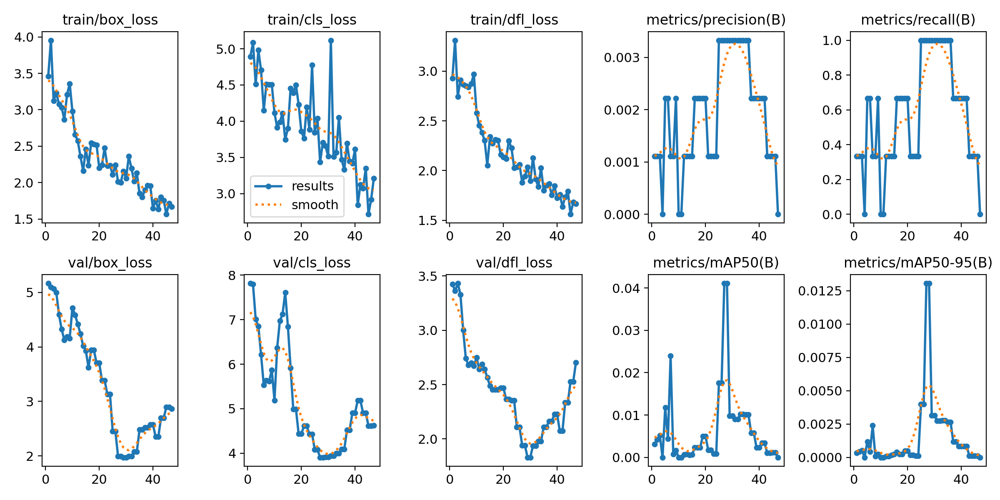
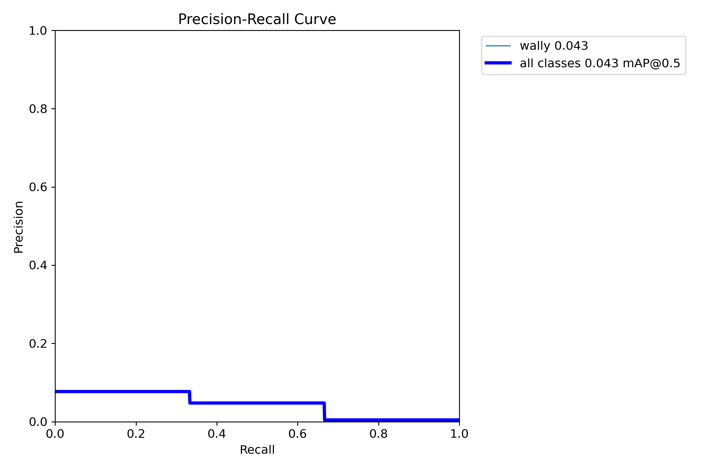
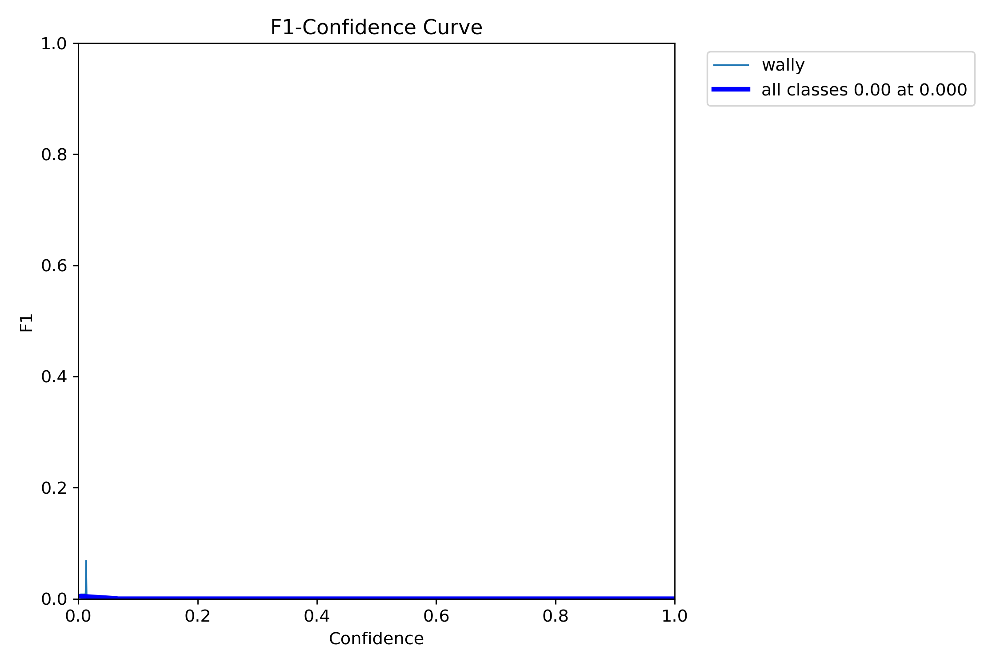
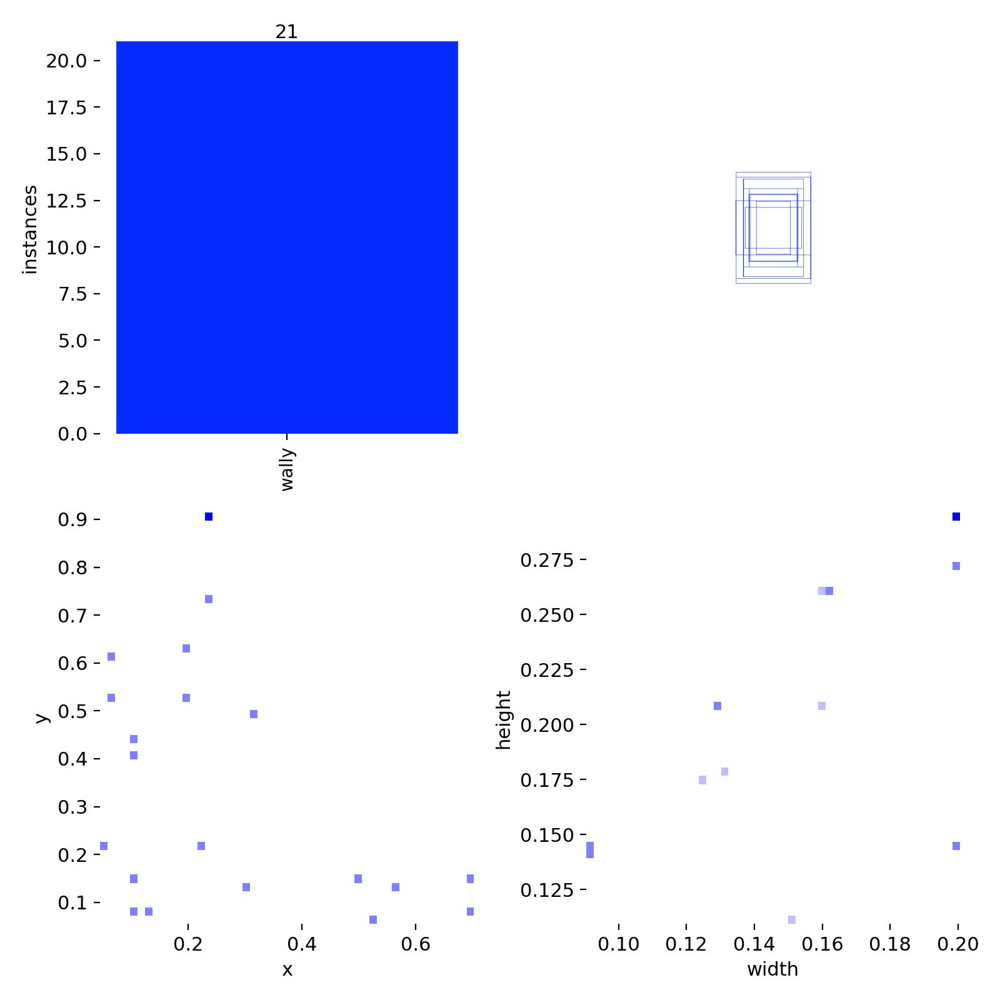
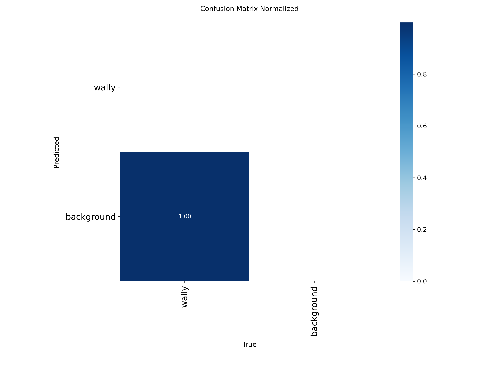
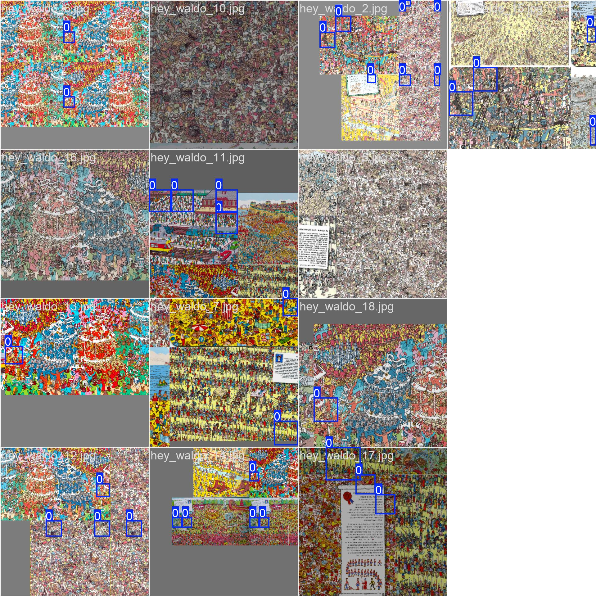
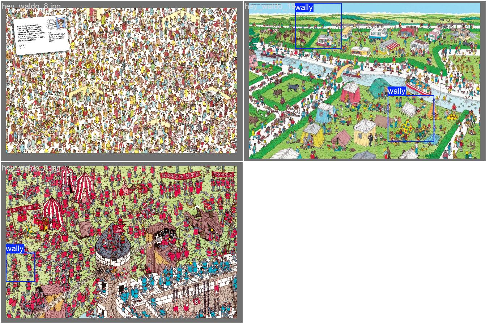
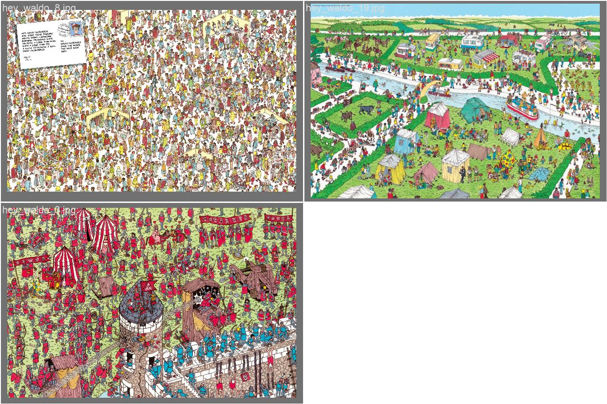

# Wally AI Training — Technical Guide

End-to-end documentation for training Ultralytics YOLO models to detect the **Wally** character (*Where's Waldo* / *Where's Wally*) in book scenes, from raw Hey-Waldo patches through YOLO bounding-box labels, training, tiled inference on full pages, and evaluation.

**Package name:** `wally-ai-search` · **CLI:** `wally-ai`

---

## Table of contents

1. [Project goal](#1-project-goal)
2. [Why two training strategies](#2-why-two-training-strategies)
3. [Dataset sources (Hey-Waldo / wally layout)](#3-dataset-sources-hey-waldo--wally-layout)
4. [YOLO label format](#4-yolo-label-format)
5. [Directory layout](#5-directory-layout)
6. [Step-by-step workflow](#6-step-by-step-workflow)
7. [How bounding boxes are created](#7-how-bounding-boxes-are-created)
8. [Training hyperparameters](#8-training-hyperparameters) — includes [latest training results](#latest-training-results)
9. [Tiled inference on full scenes](#9-tiled-inference-on-full-scenes)
10. [Troubleshooting](#10-troubleshooting)
11. [CLI reference](#11-cli-reference)
12. [Development](#12-development)
13. [Project architecture](#13-project-architecture)

---

## 1. Project goal

This repository trains and runs **single-class object detection** (class `0` = `wally`) with [Ultralytics YOLOv8](https://docs.ultralytics.com/). The intended use cases are:

- **Train** a detector on either full book scenes or fixed-size tiles where Waldo is easier to see.
- **Evaluate** mAP and related metrics on a held-out split.
- **Predict** on new images, including **tiled inference** that slides a 256×256 window over a full page and merges detections.

The upstream data comes from the [Hey-Waldo](https://github.com/brendenlake/Hey-Waldo) release (or a mirror with the same folder layout, often unpacked as `~/Downloads/wally` or `~/Downloads/Hey-Waldo`).

---

## 2. Why two training strategies

| Strategy | Import command | Training config | Input data | Best for |
|----------|----------------|-----------------|------------|----------|
| **A — Tiled training (recommended)** | `import-waldo-tiles` | `dataset_tiles.yaml` + `training_tiles.yaml` | `256/waldo` and `256/notwaldo` patches | Learning Waldo appearance at **256×256**; detect on full scenes via `predict-tiled` |
| **B — Full-scene training (optional)** | `import-hey-waldo` | `dataset.yaml` + `training.yaml` | `original-images/` + grid labels from `256/waldo/` filenames | Direct bbox prediction on whole pages (often **fails** with default settings) |

### Strategy A — Tiled training 

Train on **256×256 crops** where positive `waldo/` tiles contain Waldo filling the frame. At inference time, run the same tile size over the full scene, shift boxes to global coordinates, and apply NMS.

**Why it works:** In a typical Hey-Waldo page (~2800×1760 px), a 256×256 Waldo cell is roughly **9% × 14%** of the image. YOLO at `imgsz: 640` still sees Waldo as a very small object (~40×40 px effective), which is hard to learn from only **19 scenes**. Tiles make Waldo occupy most of the training image.

### Strategy B — Full-scene detection (option B)

`import-hey-waldo` copies each `original-images/{id}.jpg` and writes YOLO labels by mapping each `256/waldo/{id}_{row}_{col}.jpg` filename to a **256×256 pixel rectangle** on the scene grid.

**Why it often fails:** Same tiny-object problem, small dataset, and class imbalance (one Waldo per scene vs huge background). Useful as a baseline or after **manual label refinement** (LabelImg, Roboflow).

---

## 3. Dataset sources (Hey-Waldo / wally layout)

Expected root (examples: `~/Downloads/wally`, `~/Downloads/Hey-Waldo`):

```text
<dataset-root>/
  original-images/     # Full book spreads: 1.jpg … 20.jpg (19 usable with patches)
  64/
    waldo/
    notwaldo/
  128/
    waldo/
    notwaldo/
  256/                 # Default patch size for imports
    waldo/             # Positive tiles: {imageId}_{row}_{col}.jpg
    notwaldo/          # Negative tiles: same naming, no Waldo in cell
```

### Patch filename convention

```text
{imageId}_{row}_{col}.jpg
```

Example: `5_0_1.jpg` → scene `5`, grid row `0`, column `1` (0-based). Patch size is implied by the parent folder (`64`, `128`, or `256`).

### Import behavior notes

| Topic | Behavior |
|-------|----------|
| Scenes without Waldo patches | Still imported; **empty** `.txt` label (negative image). Examples: Hey-Waldo images **8** and **15**. |
| Patches without matching original | Skipped with warning. Example: patches for image **21** (no `original-images/21.jpg`). |
| Scene count | **19** full scenes when all originals are present |
| Default split | 70% train / 15% val / 15% test, `seed=42` |
| Tile negatives | `import-waldo-tiles` subsamples `notwaldo/` to at most `max_negative_ratio ×` waldo count (default **3.0**) |

### Why full-scene training struggles

For a 2800×1760 image and 256 px cells:

- Cell width fraction: `256/2800 ≈ 0.091`
- At `imgsz: 640`, Waldo width in network input ≈ `0.091 × 640 ≈ 58` pixels — far below what small-object detection usually needs, especially with **~13 training scenes**.

### Why tiled training works

Each positive `waldo/` patch is a **256×256** image with Waldo centered in the crop; the label is a **full-frame box** (`0 0.5 0.5 1 1`). The model learns “Waldo-like appearance in a tile,” then `predict-tiled` applies that at the same scale on the full page.

---

## 4. YOLO label format

Ultralytics expects one `.txt` per image, same basename as the image, in `labels/<split>/`:

```text
<class_id> <cx> <cy> <w> <h>
```

All of `cx`, `cy`, `w`, `h` are **normalized** to `[0, 1]` relative to image width and height.

| Field | Meaning |
|-------|---------|
| `class_id` | Integer class index; **`0` = wally** (only class) |
| `cx`, `cy` | Center of box |
| `w`, `h` | Box width and height |

Multiple lines = multiple objects in one image.

### Tile label (strategy A)

Every imported positive waldo tile:

```text
0 0.500000 0.500000 1.000000 1.000000
```

Negative `notwaldo` tiles get an **empty** file.

### Scene label (strategy B) — grid math

For patch `(row, col)` with `patch_size` (default 256) and scene size `(image_width, image_height)`:

```text
x1 = col * patch_size
y1 = row * patch_size
x2 = x1 + patch_size
y2 = y1 + patch_size

cx = ((x1 + x2) / 2) / image_width
cy = ((y1 + y2) / 2) / image_height
w  = patch_size / image_width
h  = patch_size / image_height
```

**Worked example:** scene `2800×1760`, patch `row=0`, `col=1`, `patch_size=256`:

| Quantity | Value |
|----------|-------|
| Pixel box | x: 256–512, y: 0–256 |
| Normalized line | `0 0.137143 0.072727 0.091429 0.145455` |

(Matches `hey_waldo_5.txt` in the imported dataset.)

**Second box** on the same scene (`row=1`, `col=0`): `0 0.045714 0.218182 0.091429 0.145455`.

Implementation: `patch_to_yolo_line()` in `src/wally_ai_search/data/hey_waldo_import.py`.

---

## 5. Directory layout

### Repository (code and configs)

```text
wally-ai-training/
  pyproject.toml          # Package wally-ai-search, entry point wally-ai
  configs/
    dataset.yaml          # Full-scene dataset → data/datasets/wally
    dataset_tiles.yaml    # Tile dataset → data/datasets/wally_tiles
    training.yaml         # imgsz 640, 100 epochs
    training_tiles.yaml   # imgsz 256, 150 epochs
    inference.yaml        # Standard predict on val/test
    inference_tiled.yaml  # Tiled full-scene predict
  src/wally_ai_search/
    cli/main.py           # Typer CLI
    data/
      hey_waldo_import.py
      waldo_tiles_import.py
    utils/tiled_inference.py
    pipelines/            # train, predict, evaluate, tiled predict
  data/
    raw/                  # Import manifests (not large binary blobs in git)
    datasets/
  runs/                   # Training and prediction outputs (gitignored)
  docs/training/latest/   # Committed copies of latest train plots (for README)
  tests/
```

### YOLO dataset — full scenes (`data/datasets/wally/`)

```text
data/datasets/wally/
  images/
    train/   hey_waldo_{id}.jpg
    val/
    test/
  labels/
    train/   hey_waldo_{id}.txt
    val/
    test/
```

After import with default split: **13 train / 3 val / 3 test** scenes (19 total).

### YOLO dataset — tiles (`data/datasets/wally_tiles/`)

```text
data/datasets/wally_tiles/
  images/
    train/
      waldo_tile_{imageId}_{row}_{col}.jpg
      notwaldo_tile_{imageId}_{row}_{col}.jpg
    val/
    test/
  labels/
    train/
      waldo_tile_*.txt      # one line: full-frame box
      notwaldo_tile_*.txt   # empty
    ...
```

Example imported counts (seed 42, `max_negative_ratio=3.0`):

| Split | Waldo tiles | Not-Waldo tiles | Total |
|-------|-------------|-----------------|-------|
| train | 25 | 86 | 111 |
| val | 8 | 24 | 32 |
| test | 11 | 25 | 36 |
| **Total** | **44** | **135** | **179** |

Import metadata is recorded under `data/raw/wally_tiles/import_manifest.txt` (and `data/raw/hey-waldo/` for scene import).

---

## 6. Step-by-step workflow

### Prerequisites

- **Python 3.9+** (`requires-python` in `pyproject.toml`; **3.11+** recommended for development tooling)
- **CUDA GPU** recommended for training
- Hey-Waldo (or equivalent) unpacked locally

### 1. Clone and install

```bash
cd wally-ai-training
python3 -m venv .venv
source .venv/bin/activate   # Windows: .venv\Scripts\activate
pip install -e ".[dev]"     # or: pip install -e .
```

Verify the CLI:

```bash
wally-ai --help
```

If you see `command not found: wally-ai`, the package is not installed in the active environment — run `pip install -e .` again from the project root.

### 2. Import datasets

**Recommended — tiles:**

```bash
wally-ai import-waldo-tiles ~/Downloads/wally --overwrite
# Makefile shortcut:
make import-waldo-tiles
```

**Optional — full scenes:**

```bash
wally-ai import-hey-waldo ~/Downloads/Hey-Waldo --overwrite
# or: make import-hey-waldo
```

Options for both importers: `--patch-size` (64/128/256), `--val-ratio`, `--test-ratio`, `--seed`, `--overwrite`. Tiles also support `--max-negative-ratio`.

### 3. Train

**Tiled model (recommended):**

```bash
wally-ai train \
  --dataset-config configs/dataset_tiles.yaml \
  --training-config configs/training_tiles.yaml
# or:
make train-tiles
```

**Full-scene model:**

```bash
wally-ai train
# uses configs/dataset.yaml + configs/training.yaml
# or: make train
```

Weights and logs: `runs/wally_tiles_train/` or `runs/wally_train/` (see [§8](#8-training-hyperparameters)).

### 4. Predict

**Single forward pass (same resolution as training):**

```bash
wally-ai predict --source path/to/images
# default: configs/inference.yaml, weights runs/wally_train/weights/best.pt
```

**Full scene with tile model:**

```bash
wally-ai predict-tiled \
  -s data/datasets/wally/images/test/hey_waldo_5.jpg \
  --inference-config configs/inference_tiled.yaml
# or: make predict-tiled
```

Output image: `runs/wally_tiled_predict/<stem>_tiled.jpg`.

### 5. Evaluate

Runs Ultralytics `val` on the **validation** split using weights from inference config:

```bash
wally-ai evaluate
# default dataset: configs/dataset.yaml, inference: configs/inference.yaml
```

For the tile model, pass matching configs:

```bash
wally-ai evaluate \
  --dataset-config configs/dataset_tiles.yaml \
  --inference-config configs/inference_tiled.yaml
```

---

## 7. How bounding boxes are created

### 7.1 Tile import (`waldo_tiles_import.py`)

1. **Collect** all `*.jpg` from `{patch_size}/waldo` and `{patch_size}/notwaldo`.
2. **Subsample** negatives: `min(len(negatives), max(len(positives), positives × max_negative_ratio))`.
3. **Split stratified by class:** waldo and notwaldo are shuffled and split **separately** (train/val/test per class), then combined per split. This avoids empty val/test for a single class on small sets.
4. **Copy** images with prefixes `waldo_tile_` / `notwaldo_tile_`.
5. **Write labels:**
   - Waldo → `0 0.500000 0.500000 1.000000 1.000000`
   - Notwaldo → empty file

### 7.2 Scene import (`hey_waldo_import.py`)

1. **Index** waldo patches by `imageId` from filenames.
2. **Pair** each `original-images/{id}.jpg` with its patch list.
3. **Split** all scenes together (not stratified by presence of Waldo).
4. **Copy** to `hey_waldo_{id}.jpg`.
5. **For each patch**, open the scene with Pillow, read `width`/`height`, emit one YOLO line per patch via `patch_to_yolo_line()`.
6. Scenes with no patches → empty label (hard negative).

### 7.3 Tiled inference (`tiled_predict_pipeline.py` + `tiled_inference.py`)


1. **`compute_tile_windows`:** stride = `tile_size - overlap` (default 256 − 64 = 192). Skip windows smaller than 25% of `tile_size` on edges.
2. **`extract_tile`:** crop window; pad to `tile_size` with black if edge tile is smaller.
3. **`YoloPredictor`:** run at `imgsz=tile_size`, collect `xyxy` boxes.
4. **`shift_boxes_to_global`:** add `x_offset` / `y_offset` to box coordinates.
5. **`nms_global_detections`:** greedy NMS on global boxes using `merge_iou` (default 0.45).

---

## 8. Training hyperparameters

Configs are merged into Ultralytics `model.train()`. A generated manifest is written to `runs/wally_dataset.yaml` on each train/eval run.

### `configs/training.yaml` (full scenes)

| Key | Default | Notes |
|-----|---------|-------|
| `model` | `yolov8n.pt` | Nano backbone |
| `epochs` | `100` | |
| `imgsz` | `640` | Matches large-scene scale |
| `batch` | `16` | |
| `patience` | `20` | Early stopping |
| `name` | `wally_train` | Output under `runs/wally_train/` |

### `configs/training_tiles.yaml` (recommended)

| Key | Default | Notes |
|-----|---------|-------|
| `epochs` | `150` | More epochs for smaller images |
| `imgsz` | `256` | **Must match** tile size and tiled inference |
| `patience` | `30` | |
| `name` | `wally_tiles_train` | Weights: `runs/wally_tiles_train/weights/best.pt` |

Shared defaults: `lr0=0.01`, `optimizer=auto`, `seed=42`, `val=true`, `plots=true`.

### `configs/inference_tiled.yaml`

| Key | Default |
|-----|---------|
| `weights` | `runs/wally_tiles_train/weights/best.pt` |
| `imgsz` | `256` |
| `tile_size` | `256` |
| `tile_overlap` | `64` |
| `conf` | `0.15` |
| `merge_iou` | `0.45` |

### Latest training results {#latest-training-results}

Plots below are copied from the **most recent** Ultralytics run on this machine so the README stays valid even though `runs/` is gitignored. Refresh after a new train (see [Refreshing plots](#refreshing-plots)).

| Field | Value |
|-------|-------|
| **Run directory** | `runs/detect/runs/wally_train-2/` |
| **Strategy** | **B — full-scene** (`data/datasets/wally`, not tiles) |
| **Config** | `configs/dataset.yaml` + `configs/training.yaml` (`name: wally_train` → auto-renamed `wally_train-2`) |
| **Model** | `yolov8n.pt` · **imgsz** `640` · **epochs** `100` (stopped at epoch 47, patience 20) |
| **Dataset manifest** | `runs/wally_dataset.yaml` → `path: data/datasets/wally` |
| **Plots source** | `runs/detect/runs/wally_train-2/` → committed under `docs/training/latest/` |

Final validation metrics (epoch 47): precision **0**, recall **0**, mAP@0.5 **0**, mAP@0.5:0.95 **0** — consistent with [§2](#2-why-two-training-strategies) (tiny Waldo on full pages). Prefer **tile training** (`make train-tiles`) for usable detectors.

#### Training curves and metrics



*Composite plot: box/cls/dfl losses (train & val) and precision, recall, mAP@0.5, mAP@0.5:0.95 over epochs.*



*PR curve at IoU 0.5 for the `wally` class — flat near zero reflects failed full-scene detection.*



*F1 score across confidence thresholds; peak F1 near zero matches low mAP.*

#### Dataset and validation quality



*Dataset label statistics: class counts and normalized box centers/sizes in the training set.*



*Confusion matrix (normalized): model rarely predicts true positives on val.*

#### Sample batches



*First training batch with mosaic — full book spreads; Waldo boxes are small relative to image size.*



*Validation images with ground-truth boxes (green).*



*Same val batch with model predictions — few or no confident Waldo detections.*

#### Refreshing plots {#refreshing-plots}

After `wally-ai train` or `make train-tiles`, copy plots from the newest run folder (highest mtime under `runs/detect/runs/` or `runs/wally_tiles_train/`):

```bash
RUN=runs/detect/runs/wally_train-2   # or: runs/wally_tiles_train, etc.
DEST=docs/training/latest
mkdir -p "$DEST"
for f in results.png BoxPR_curve.png BoxF1_curve.png confusion_matrix_normalized.png \
         labels.jpg train_batch0.jpg val_batch0_labels.jpg val_batch0_pred.jpg; do
  [ -f "$RUN/$f" ] && cp "$RUN/$f" "$DEST/$f"
done
```

If no PNG/JPG plots exist yet, train with `plots: true` in the training YAML (default), then re-run the copy step above.

---

## 9. Tiled inference on full scenes

Use a **tile-trained** checkpoint. Point `-s` at any full-page JPEG (imported test scenes work well):

```bash
wally-ai predict-tiled \
  -s data/datasets/wally/images/test/hey_waldo_5.jpg \
  --inference-config configs/inference_tiled.yaml
```

Tune `conf`, `tile_overlap`, and `merge_iou` in the YAML if you see duplicate boxes or missed detections.

---

## 10. Troubleshooting

| Problem | Cause / fix |
|---------|-------------|
| `wally-ai: command not found` | Activate venv; run `pip install -e .` from project root |
| `FileExistsError` on import | Add `--overwrite` or delete existing files under `data/datasets/` |
| Full-scene training never converges | Expected with 19 tiny objects; switch to **tile pipeline** or lower `imgsz` only after careful label QA |
| Val split has no waldo tiles | Fixed: `split_samples()` splits **per class** then merges; older versions split the combined list and could empty a class in val/test |
| Very low mAP | Small dataset; try more epochs, data augmentation (external), or manual labels |
| `predict-tiled` finds nothing | Train with `training_tiles.yaml`; ensure `weights` in `inference_tiled.yaml` exists; lower `conf` |
| Wrong boxes on scenes | Patch grid assumes fixed `patch_size`; if labels are wrong, refine in LabelImg and replace `labels/` |
| Image 21 patches | No `original-images/21.jpg` — importer skips those patches by design |
| GPU not used | Set `device: 0` (or `"cuda"`) in training/inference YAML |

### Manual label refinement

1. Import once with `--overwrite`.
2. Edit `data/datasets/wally/labels/<split>/*.txt` or re-annotate in [LabelImg](https://github.com/HumanSignal/labelImg) (YOLO format).
3. Re-run `wally-ai train` without re-importing, or re-import after fixing upstream patches.

---

## 11. CLI reference

| Command | Description |
|---------|-------------|
| `wally-ai` | Root Typer app; `--log-level` on all commands |
| `wally-ai train` | Train YOLO; optional `--dataset-config`, `--training-config` |
| `wally-ai predict` | Run inference; `-s` / `--source`, `--inference-config` |
| `wally-ai predict-tiled` | Tile large image → detect → NMS → save annotated JPEG |
| `wally-ai evaluate` | Validation metrics; `--dataset-config`, `--inference-config` |
| `wally-ai import-waldo-tiles <root>` | Build `data/datasets/wally_tiles` from `256/waldo` + `256/notwaldo` |
| `wally-ai import-hey-waldo <root>` | Build `data/datasets/wally` from `original-images` + waldo patch grid |

### Common options

| Option | Commands | Default |
|--------|----------|---------|
| `--overwrite` | import-* | `false` |
| `--patch-size` | import-* | `256` |
| `--val-ratio` | import-* | `0.15` |
| `--test-ratio` | import-* | `0.15` |
| `--seed` | import-* | `42` |
| `--max-negative-ratio` | `import-waldo-tiles` | `3.0` |

### Makefile targets

| Target | Equivalent |
|--------|------------|
| `make install` | `pip install -e .` |
| `make install-dev` | `pip install -e ".[dev]"` |
| `make import-waldo-tiles` | `wally-ai import-waldo-tiles ~/Downloads/wally --overwrite` |
| `make import-hey-waldo` | `wally-ai import-hey-waldo ~/Downloads/Hey-Waldo --overwrite` |
| `make train` | `wally-ai train` |
| `make train-tiles` | `wally-ai train` with tile configs |
| `make predict` | `wally-ai predict` on test images |
| `make predict-tiled` | Example tiled predict on `hey_waldo_5.jpg` |
| `make evaluate` | `wally-ai evaluate` |
| `make lint` / `test` / `typecheck` | Dev quality gates |

---

## 12. Development

```bash
make lint       # ruff check
make format     # ruff format + fix
make typecheck  # mypy on src/wally_ai_search
make test       # pytest tests/
```

Key tests:

- `tests/test_hey_waldo_import.py` — patch parsing, YOLO line math, scene records
- `tests/test_waldo_tiles_import.py` — negative sampling, stratified split
- `tests/test_tiled_inference.py` — tile windows, NMS, coordinate shift

---

## 13. Project architecture

Layers (see also `.cursor/rules/wally-ai-search.mdc`):

| Layer | Role |
|-------|------|
| `cli/` | Typer commands |
| `pipelines/` | Orchestrate train / predict / evaluate / tiled predict |
| `data/` | Dataset import, YOLO manifest generation |
| `models/` | Thin Ultralytics wrappers (train, predict, eval) |
| `utils/` | Logging, tiled geometry, metrics |
| `config/` | Paths resolution, YAML loading |

**Design principles:** English-only code and docs; minimal comments; configs drive hyperparameters; `runs/` holds all experiment artifacts (gitignored).

---

## References

- [Hey-Waldo dataset](https://www.kaggle.com/datasets/residentmario/wheres-waldo)
- [Ultralytics YOLOv8 docs](https://docs.ultralytics.com/)
